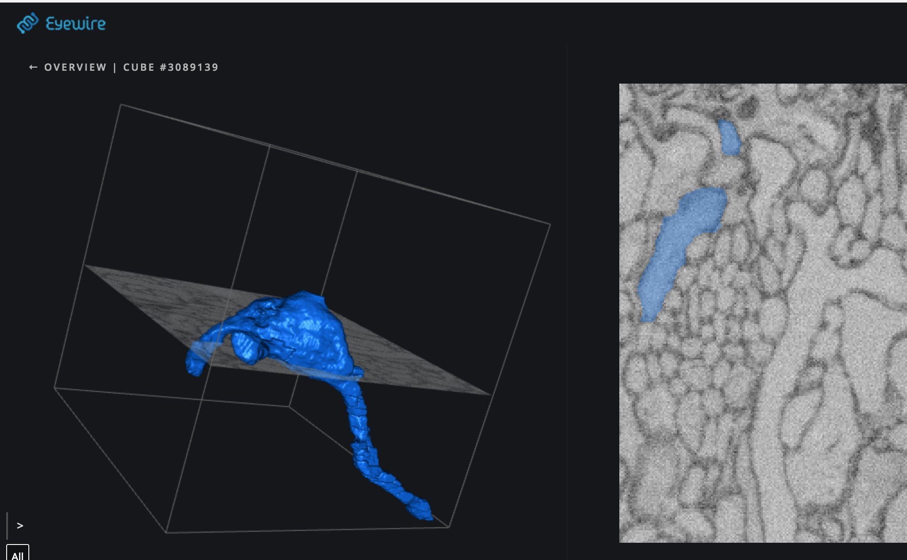
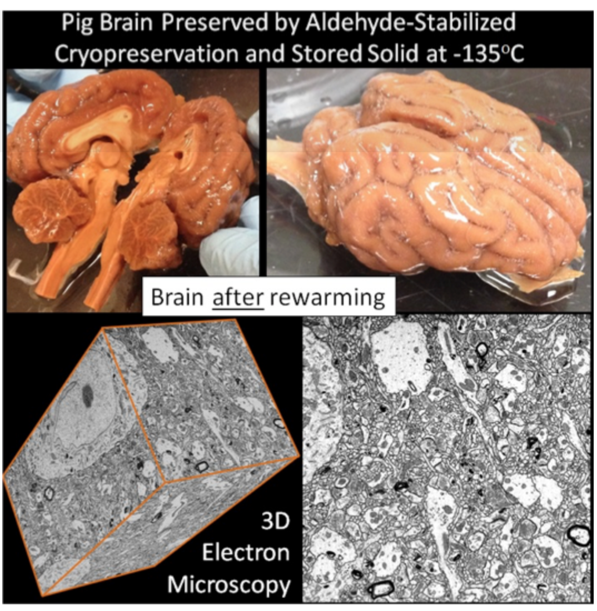
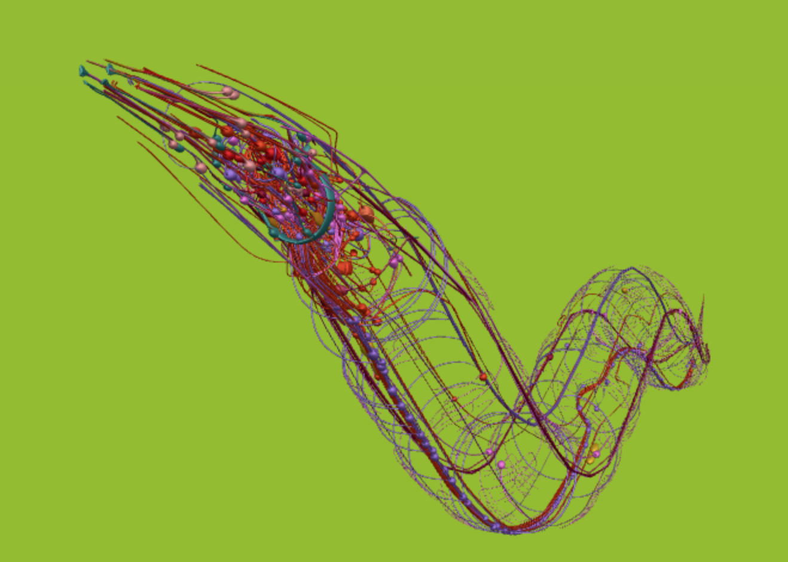

如果有一个机会可以永久保存你的意识，甚至在未来“复活”你的精神世界，你愿意这样做吗？
即使代价是要主动结束自己当下的生命？

的确有人愿意，比如“大脑保存基金会”（brain reservation foundation，以下简称脑保会）的创始人小沃Kenneth Hayworth。他理想中的死亡是这样的【1】：在他还没有太老或太病弱时，他会选择“早退休”，与亲人朋友举办告别派对后一起去医院。他会被麻醉，被注入冷冻保存剂，在一瞬间即死亡，在大脑的任何蛋白质和磷脂都还没有发生变化之前。此后大脑被固定，塑料化，被切片，在电子显微镜下获得高清图像，通过数据处理手段复原出神经元之间的全套连接组并上传。
目前能做的就到此为止。然后便是等待，希望未来100年后的科学家能够有对大脑深入更多的了解，从小沃精心保存的数据中，在未来计算机上重新模拟大脑运行，还原出机器版的他。一切基于乐观主义精神：尽管现在技术还远远做不到“意识复活”，但我们终将到达。

“如何数字化地保存个体意识”，或说“如何进行意识上传”？这个科幻味道过浓的问题尚不是主流神经科学界的热门研究领域，以至于上了两年研究生神经科学课程的我，在发现“大脑保存基金会”这个组织的存在后，着实拍桌大叹，所幸没有惊倒讲台上的老教授（其人正在讲解神经如何控制眼球转动）。近年来神经科学到底有何进展，给了小沃及同道中人们如此的信心？他们的技术逻辑是什么？真的讲得通吗？为什么又有大量科学家对此理想旗帜鲜明地唱衰？

# 为记忆永生而奋斗的人们
Kenneth Hayworth并不是唯一一个愿意把自己大脑冷冻起来交给未来的人。
人体冷冻技术cryonics早已被付诸实践。早在1972年，美国亚利桑那州的“阿爾科生命延續基金Alcor Life Extension Foundation”就已经开始提供人体冷冻技术，把死亡后的人冷冻在液氮里，至今有约150人接受了此项服务（仅保存大脑系统需要付费100,000美元）。
听起来是个好主意：包子吃不完，冷冻起来再解冻可松软如常；人还不想死，冷冻起来再解冻大概也会松软新鲜？然而实操中，细胞比发面团要娇嫩一些：冷冻会导致细胞液浓度失衡，大量细胞液渗流而出，细胞即会在压力下破裂，死去。要想从冷冻的大脑中复原神经系统，首先，至少需要技术上证明冷冻的大脑可以完美保存神经元的结构。
2018年组建的创业公司“nectome”认为自己找到了很有潜力的方向。他们采用技术叫做“醛稳定剂人体冷冻术Aldehyde-Stabilized Cryopreservation”：先向活脑中注射醛类保存剂，把Q弹鲜嫩的大脑组织固定，然后再进行急速冷冻。这也就是文章开头的小沃所选择的死亡方式。“用户体验和安乐死类似。”公司创始人McIntyre介绍说。Nectome认为他们的服务根据加州的安乐死相关法律是完全合法的，而根据【2】的报道，已有至少25人缴纳了$1万美元定金，希望接受nectome的这项服务（但在技术完全成熟之前，他们还没有开始提供服务）。
nectome对自己技术的信心来源之一是，他们获得了大脑保存基金会的10万美元奖金。其中8万美元的奖金，在2016年2月送给了“21世纪医学”公司（21st Century Medicine，也是netcome联合创始人McIntyre的前公司），因为他们成功把——不，不是人脑——猪脑“完美保存”。

可是，稍等，什么叫“完美保存”？我们手里这个冻猪脑到底包含了它的什么记忆，什么人格（猪格），我们还毫无头绪呢，怎么知道里面的数据可用？
因为其中保存了猪脑的全部150亿个神经元连接（即“突触”），这几百亿个突触组成了所谓的“连接组”（connectum）。
连接组在主流神经科学研究中也是一个热门话题，比如在2010年美国国家卫生院就发布了一个四千万美元的"人脑连接组计划”，有着继续上世纪“人类基因组计划”的雄心。
如果想直接看看连接组长什么样，你可以在Eyewire.org上玩这个游戏，参与从二维切片数据中重构三维图像的科学工作。

为什么关心连接组呢？连接组对你我为何重要？

因为神经元的连接可能代表了大脑运行的重要信息。我们常用电路（wiring）来比喻大脑，比如神经元的放电是“全或无”的脉冲（spikes）就很类似离散的0-1信号；照此推论，如果想复制整个电路，我们只需要画出所有元器件（=神经元）以及其连线（=连接组）就齐活了。
普林斯顿大学教授Sebastian Cheung即著有科普书和同名TED演讲，“我是我的连接组”（如果你还没看股哦，强烈建议你在读罢本文后，再批判性观看）。
当然，在还没有真正复原神经系统活动之前，这只是一个理论假设。为什么这个假设可能是正确的？Sebastian Cheung的论证如下：
第一，我们知道尽管人的神经元数量在出生后就不会变化，然而神经元之间的连接——“突触”——却一直在不断的变化，正如我们的经历、性格、技能都在一直变化。这一点让连接组和一生不变的基因组有显著不同：连接组的信息可能同时包含了先天和后天。
第二，突触的连接强度变化受神经电、化学活动调节（比如两个同时放电的神经元之间突触连接会加强），而我们早就知道，这些神经活动与感知、意识、学习密切相关。
第三，反过来说，神经活动又必须通过连接组进行传导。也就是说，连接组中储存的信息必然与精神世界有关。
Sebastian给出了这样比喻：如果说神经活动是一刻不停的奔流河水，连接组就是河床。河床决定了河水的流向，知道了河床的分布也就可以模拟水网的运动。

总结一下，意识上传并不是直接扫描大脑读取一部你的人生电影，而是先通过合适的冷冻技术固定大脑结构，然后将其切片放在显微镜下，通过新近快速发展的图像处理技术，读出大脑中的连接组，把连接组的数据存储在电脑中，等待后人利用这些原始数据材料复活意识。

但是无比聪明的未来人，会对100年前留下的连接组数据感到足够满意吗？

# 技术难关
别说未来科学家，现在就已经有不少科学家非常不满了。
Nectome在18年初曾获得MIT的背书，然而不到一个月MIT方面就发表声明停止了合作。他们认为在一些根本科学问题解决之前，许下“复活大脑”的诺言，为时过早。【3】
我认为，至少有两个基本问题：第一，连接组数据是否足够我们复制大脑的神经活动？第二，如何判断是否成功复制了神经活动、怎样才能算作“复制意识”？

## 连接组：只是残破的地图？
由于连接组是这样一个耀眼的科学项目，也是吸收了大量科研经费的项目，很多神经科学家都在争议：连接组真的有那么有用吗？
一个具体的失败：复制全连接组这件事我们已经在其它动物身上做到了，然而我们却还没能完全复制动物的神经活动。
早在80年代，科学家就已经了然C-elegans（一种长约1毫米的线虫）全部302个神经元之间的7000个突触连接。如果想直观地看看C-elegans的连接组，你可以打开浏览器：http://browser.openworm.org/

C.elegans的样子

openworm浏览器中看C.elegans的连接组。

然而知道了所有电路图，我们却没法通上电就完全模拟这些神经元之间的电信号。
原因之一是，我们知道“水往低处流，电往低电位处走”，这些相对简单的物理规律和生物系统的复杂性不可同日而语。比如说，神经元们浸泡在复杂的化学溶液中，周围多种离子、神经递质都对其有调节：“我们知道一种化学物质会引起某些反应，另一种会引起相反的反应，但这两种信号都出现在同一条通路上。连接组怎么解释这件事？”纽约大学前神经科学系主任的J. Anthony Movshon抱怨道。
也许未来某天，连接组加上生化物质的信号，科学家可以完美预测神经信号的走向，然而目前的大脑保存方案却未必能完美保存这些脆弱的生化环境。
更何况，前述冷冻大脑的方案只存了某一时刻的所有化学物质，如果一条通路可以在不同时刻使用不同化学物质来沟通信号，这些历史变化信息也必然无法保存。唯一的希望或许是未来人们能够强大到由某一时刻的定格，推算出电路所有其它可能的状态。
人们正在往这个方向努力。如前所述提供在线浏览C.elegans连接组的openworm（开放虫子？）项目，其下一步目标就是模拟一个生物意义上更真实的线虫大脑，包括模拟每个神经元的细胞膜离子通道，相应的电势反应，等等。系统是完全开源的，所有人都可以进行模拟。然而这个项目的最新消息也在4年以前，不知如今进展如何。
甚至，我们也不确定是否只有神经元才传导信号：大脑中的细胞只有10%是神经元，剩下90%都是神经胶质细胞（glia）。胞如其名，多年来人们一直认为神经胶质细胞是固定神经元的胶水，保持神经元之间绝缘，如同电路板一般。然而我们现在越来越清楚，至少有一种胶质细胞——星型细胞（astrocyte）同样可以释放电信号，并且通过调节钙离子浓度使得神经元放电。这些信号是否与意识活动有关尚存争议，比如University of Hartford的教授Andrew Koob提出假设，我们的白日梦中那些随机的混乱想法或许就来自胶质细胞的随机放电。【4】
尽管已经以很严苛的标准来衡量大脑保存的完整性，然而在这趟时空穿梭之旅中，我们到底带没带够复活必备用品？这一点仍然未知。

第二个问题：即使我们能够利用足够的数据，在电脑中完全模拟神经电路，我们就模拟了“意识”吗？
科幻爱好者们经常问的一个问题是，“把意识搬到电脑里运行，那我还是我吗？”这个看似很哲学的问题，其实前半部分已经是很困难的科学问题：怎么可能知道意识是否已经被搬到电脑里？既然不太可能记录所有你生命中的神经活动，就不可能与机器对比，判断说所有的神经活动都已被机器复制，那么什么叫“成功的模拟”呢？
最耳熟能详的办法是图灵测试：如果这个机器“系统”，谈笑坐卧如常人——即，输出与人相似的行动，那么可以认为它拥有和曾经那个人一样的意识。这个办法可以算是最低要求了，我们甚至不需要要求机器有与人类相同的内在的心理挣扎和白日梦。
但是，如何把神经系统的活动和外在表现出来的行动联系起来，也已然是神经科学所面临的最困难的问题之一。 
还是以C.elegans为例。在有了全连接组图谱后，科学家试图理解这小虫子的口胃系统（Stomatogastric nervous system）是怎么受神经系统的调控的。然而即使如此低级、不涉及认知的简单系统，Brandeis University的Eve Marder等人发现，这个仅包含30个神经元的通路，身段非常灵活：对于同一个神经元，有些情况下它会参与幽门收缩扩张的子通路，有时候参与控制“胃磨？？”（gastric mill）的消化通路【5】。
“某个区域神经元执行某个特定功能”的叙事，注定是种过分简化的想象。
这些神经元的控制机制需要通过大量的实验来确定，比如损伤一个神经元，然后观察活体动物的实际反应变化；比如设计两个极其类似但些微不同的实验条件，观察动物行为有哪些不同，对应的神经活动又有何不同。其中所需的工作量绝不比精确绘制神经元连接的图谱更轻松，需要精巧的实验设计、聪明的实验假说、准确的神经动态记录。
事实上，这恰恰是很多科学家反对“全连接组绘制”计划的原因：并不是说它没有帮助，但投入其中的人力和资源却未必能得到丰厚的产出。

【需要一个总结句】

# 我的建议：保存你的生命经历
目前所有关于“意识上传”的设想，总结起来大概是这样的操作：完全复制大脑的物质状态，保存到电脑中，然后在未来某一天读取其中数据，并且依据我们对大脑如何指挥身体的理解，把大脑中的信息提取并“表现”出来，便可以恍若再见古人。
然而大脑太复杂。身心联系太复杂。我自己不能相信在未来人类在灭绝之前，一定能够从神经活动中一一解码出外在行为，也不太能信赖如今的我们可以足够完整地保存“使我成为我”的神经信息。
不过我有个另外的设想：也许更容易的是记录我的所有人生经历，然后输入给未来的“虚拟大脑”，使其经历过我的所有经历。即使“她”的具体神经连接与我不同，但是表现出的外在行为或许会更加类似。
这个计划的基本灵感来自于如下事实：第一，通过各种传感器记录外在感知觉信号或许比记录大脑要容易一些；第二，更重要的是，神经系统非常擅长突破既定规则，依据外在经历重塑我们的感官世界。
比如临床上有“感知替代”的病例：一个麻风病人的周边感觉系统被损毁，无法感受到手的触觉，但可以感受到额头的触觉。于是医生给他戴上有触觉传感器的手套，把接触信号通过电路转为对额头皮肤的刺激信号。刚开始，手套碰到什么东西，手上当然没感觉，额头上则会有被电击的触觉，碰到不同的东西，触觉不同。但仅仅经过两天训练，额头上的触觉就可以与手的知觉对应起来，大脑直接解读出触觉的“感知”——“重新体验了已经消失20年的，触碰他的妻子的感觉”。【6】
显然，这种通过手套传感器的感知方式必然与从前的神经通路不同，然而某些外界刺激上的相似性却能够促使神经系统产生正确的解读。
说到底，我们的神经系统不是孤零零的硬盘，而是为了与活色生香的外在世界交互而存在的。

===
【1】https://www.chronicle.com/article/The-Strange-Neuroscience-of/132819
【2】https://singularityhub.com/2018/03/27/the-startup-that-has-to-kill-you-to-preserve-your-brain-heres-the-science-behind-the-buzz/
【3】 https://www.media.mit.edu/posts/the-media-lab-and-nectome/
【4】https://www.scientificamerican.com/article/the-root-of-thought-what/
【5】https://www.scientificamerican.com/article/c-elegans-connectome/
【6】https://en.wikipedia.org/wiki/Sensory_substitution#Tactile%E2%80%93tactile_to_restore_peripheral_sensation

